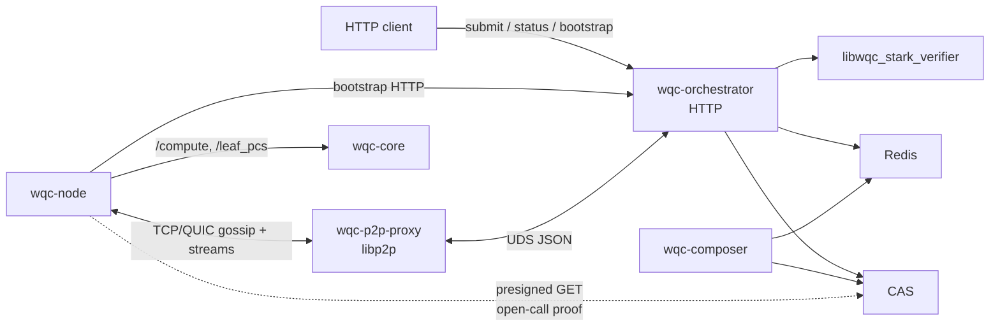
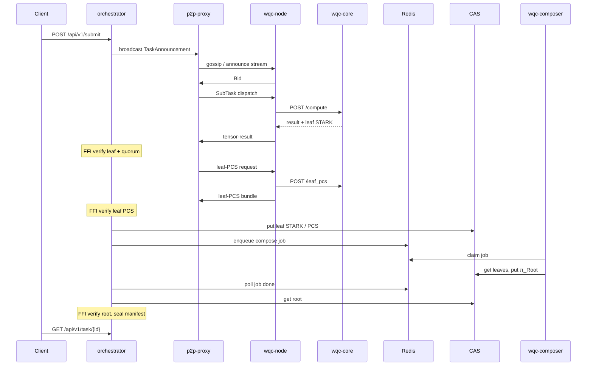

# WQC system architecture (current implementation)

- **Status:** Working spec — live component map
- **Tier:** B (implementation snapshot)
- **Verified:** 2026-08-19
- **Verified against:** `wqc-orchestrator@c94a447` `wqc-core@f162911` `wqc-node@9492fbd` `wqc-p2p-proxy@7898c96` `wqc-composer@ce3b3be` `wqc-stark-engine@db594b9`
- **Audience:** Implementers and operators who need the current component map
- **Related:** [`architecture.md`](architecture.md) — the target-state spec (sovereign network), [`economics.md`](economics.md), [`zk-STARK.md`](zk-STARK.md), [`../examples/E2E.md`](../examples/E2E.md), [`../whitepaper/WHITEPAPER_0.3_en.md`](../whitepaper/WHITEPAPER_0.3_en.md)

> This document describes the **current** WQC stack as implemented: a single orchestrator,
> a permissionless worker swarm, and a remote composer that seals a root STARK.
> It is a snapshot of the system as it exists today and will be updated as the
> implementation moves toward the target architecture. For the finished-system
> specification, see [`architecture.md`](architecture.md).

Out of scope here: DHT multi-orchestrator, on-chain settlement, physical QPU backends, and marketing-site wiring.

---

## 1. Components

| Component | Kind | Role |
| --- | --- | --- |
| **wqc-orchestrator** | Daemon | HTTP client API, compact-register slicing, bid lottery, dispatch, quorum, leaf-PCS nomination, FFI verify, compose enqueue, manifest seal |
| **wqc-p2p-proxy** | Daemon (sidecar) | rust-libp2p endpoint. Gossip and streams on the public P2P port; control plane to the orchestrator over a Unix socket |
| **wqc-node** | Daemon | Swarm agent: bid, receive dispatch, return leaf proof / PCS. One in-flight sub-task per process. Admin HTTP only |
| **wqc-core** | Daemon | Per-node compute: tensor contraction, leaf STARK prove, `/leaf_pcs`. Also `POST /verify` (local/stateless). Local HTTP or Unix socket — not a library |
| **wqc-composer** | Daemon | Redis job worker: fetch leaf artifacts from CAS, build $\pi_{\text{Root}}$, write CAS + Redis. No P2P |
| **wqc-stark-engine** | Repository | STARK workspace. Crate `wqc-stark-core` is linked in-process by core and composer (prove / compose / local verify); crate `wqc-stark-ffi` exposes `libwqc_stark_verifier` linked into the orchestrator for **consensus verify** |
| **Redis** | Infra | Task meta, bids, economy ledger, compose job queue |
| **CAS** | Infra | S3-compatible content-addressed store for leaf STARKs, leaf PCS, root proofs, manifests |

The public testnet dashboard is an HTTP client of the orchestrator. Workers never call the client API. `wqc-core` is a process, not a crate workers link. Composer is a Redis consumer, not an HTTP compose API.

---

## 2. Network and trust

Clients submit over HTTP. Workers exchange signed libp2p messages with the proxy. Prove and compose stay in Rust processes. **Consensus** verification of worker proofs is orchestrator FFI (`libwqc_stark_verifier`). `wqc-core` also exposes `POST /verify` for local/stateless checks via `wqc-stark-core`; that path is not how the swarm ingests results.



| Boundary | What crosses | Trust |
| --- | --- | --- |
| Client ↔ orchestrator HTTP | Submit, task status, bootstrap, quote | Public edge. Billing keys off `client_id` + Redis escrow |
| Node ↔ orchestrator HTTP | `GET /api/v1/p2p/bootstrap` only | Pins orchestrator PeerID and pubkey before P2P |
| Node ↔ proxy libp2p | Announcements, bids, dispatch, results, PCS | rust-libp2p both sides. Inbound peer id must equal `node_id` |
| Proxy ↔ orchestrator UDS | Length-prefixed JSON control frames | Same host |
| Node ↔ core | `/compute`, `/leaf_pcs` (optional `POST /verify`) | Typically localhost |
| Orchestrator ↔ FFI | Leaf / leaf-PCS / root verify (consensus) | In-process, no network |
| Core / composer ↔ `wqc-stark-core` | Prove / compose / local verify | In-process, no network |
| Orchestrator / composer ↔ Redis and CAS | State, queue, blobs | Private. Open-call leaf proofs and completed manifests use presigned GET |

Results do not travel over HTTP. There is no node `/submit` and no result webhook.

Live P2P is the rust-libp2p sidecar. Do not treat an in-process Go libp2p host as the production path.

---

## 3. Task lifecycle

Client-visible status roughly: `pending` → `dispatched` → `finalizing` (`waiting_pcs` → `composing_proofs` → `sealing_manifest`) → `completed` | `failed`.



1. **Submit.** `POST /api/v1/submit` on the orchestrator. Optional escrow. Returns `task_id`. Poll `GET /api/v1/task/{id}`.
2. **Announce / bid.** Signed `TaskAnnouncement` over GossipSub (with a connected-peer stream fallback). Nodes bid; the orchestrator locks a quorum-sized worker set.
3. **Cut + dispatch.** Compact-register slices (`qubit_count = N-C` after fixing $C$ tensor legs, pruned circuit, `circuit_id` = SHA3-256 of that JSON). Signed `SubTask` to winners. One in-flight sub-task per node process.
4. **Compute + prove.** Node calls core `/compute`. Core contracts the slice and proves a v2 leaf STARK in-process, then the node returns result + proof on the result stream.
5. **Quorum.** Orchestrator FFI-verifies the leaf. Scalar / expectation use epsilon match; `sample_counts` must match exactly under the orchestrator-issued seed.
6. **Leaf PCS.** Winner is nominated to build a leaf PCS bundle. Majority refuse (memory gate) can failover, then an optional PCS open call (CAS upload + swarm bid). Exhaustion falls through to composer building missing PCS during compose. Completeness is required for the RecAgg v6 fast path; without it, compose falls through to the AggregationAir audit walk.
7. **Compose.** Finalizer uploads leaves to CAS and enqueues a Redis compose job. Composer builds a binary composition tree (a single leaf is duplicated) and writes $\pi_{\text{Root}}$. The orchestrator has no in-process compose path; without a composer on the same Redis and bucket, tasks stall in `composing_proofs`.
8. **Seal.** Orchestrator FFI-verifies the root, uploads root + result manifest to CAS, and the client receives `completed` with `root_hash` and a presigned `manifest_url`.

Transcript versions, public-input binding, and RecAgg are specified in [`zk-STARK.md`](zk-STARK.md). This page only names who produces and who verifies.

---

## 4. Off-chain economy (live)

Normative units, gas, splits, and on-chain settlement rules:
[`economics.md`](economics.md). This section is how **wqc-orchestrator** implements the
off-chain ledger today (Redis, env, HTTP, receipts). On-chain settle is not implemented yet.

Billing unit = one slice + one leaf STARK. Redis may **accrue** rewards at quorum / PCS /
straggler time; after the straggler grace, burns settle, unused escrow refunds, and an
economics receipt is published.

### 4.1 Flow

1. **Quote** — `POST /api/v1/economy/quote` estimates escrow from qubit/gate count and current BaseFee:
   ```
   estimated_slices = max(1, 2^(qubits - 26))   // compact-register BFS upper bound
   per_slice        = TotalFee × (0.40×required_votes + 0.40 + 0.20)
                      //          compute per node    R_pcs  burn
                      // stragglers draw from deferred burn, not extra escrow
   escrow           = estimated_slices × per_slice × safety_bps/10000
   ```
   At `required_votes = 2` the per-slice coefficient is `1.4 × TotalFee`. Default `WQC_ESCROW_SAFETY_BPS=10000` (no margin).
2. **Submit** — client sends `client_id` (required when `WQC_CLIENT_BILLING=1`); orchestrator locks escrow from `economy:client:{id}:balance`. BaseFee is **locked per task**.
3. **Accrue** — quorum / PCS / straggler debit client escrow and credit operator balances.
4. **Finalize** — after `WQC_STRAGGLER_GRACE_SECS`, settle pending burns, refund unused escrow, upload economics receipt.

Global BaseFee adjusts on each submit from queue depth (`subtasks:active`):

```
queue > WQC_BASE_FEE_TARGET_QUEUE  →  BaseFee × (1 + adjust_bps/10000)
queue < target                     →  BaseFee × (1 - adjust_bps/10000)
clamped to [WQC_BASE_FEE_MIN, WQC_BASE_FEE_MAX]
```

Stored in Redis `economy:base_fee`.

PCS payout is credited when a **verified** leaf PCS bundle is stored (`VerifyLeafPcsBundle`).
Composer fallback pays `R_pcs` to `WQC_COMPOSER_OPERATOR_ID` once per slice (SETNX marker).

**Identities:** Node Key `nk_…` → Ed25519 operator → `operator_id` = sha256(pubkey).
Rewards credit `operator_id`, not `nk_` and not libp2p `peer_id`. See [`economics.md`](economics.md) §4.

### 4.2 Redis keys (economy)

| Key | Value |
| --- | --- |
| `economy:operator:{operator_id}:balance` | Operator pWQC balance (decimal string) |
| `economy:operator:{operator_id}:pubkey` | Operator Ed25519 public key (base64) |
| `economy:peer_operator:{peer_id}` | Maps libp2p peer → operator_id |
| `economy:client:{client_id}:balance` | Client pWQC balance |
| `economy:task:{task_id}:escrow` | Locked pWQC remaining |
| `economy:task:{task_id}:escrow_meta` | JSON: client_id, base_fee_swqc, status |
| `economy:task:{parent_task_id}:slice_economics` | HASH sub_task_id → per-slice economics JSON |
| `economy:task:{parent_task_id}:burn_pending_subtasks` | SET of sub-task IDs with pending burn |
| `economy:task:{parent_task_id}:composer_pcs:{sub_task_id}` | SETNX marker for composer fallback `R_pcs` |
| `economy:subtask:{sub_task_id}:burn_recorded` | SETNX marker; burn counted once per sub-task |
| `economy:subtask:{sub_task_id}:burn_pending` | Deferred burn budget remaining (pWQC string) |
| `economy:base_fee` | Current dynamic BaseFee (sWQC/gas) |
| `economy:burn_total` | Cumulative burn pWQC |
| `economy:foundation:balance` | Foundation reserve scaffold (metrics; **not** used for straggler payouts) |
| `economy:settlement:log` | RPUSH JSON audit entries |

Logs use `[LEDGER REWARD]`, `[LEDGER BURN]`, etc. Balances survive orchestrator restarts.
Settlement log types include `escrow_lock`, `escrow_debit`, `escrow_refund`, `client_credit`.

### 4.3 Environment

| Env | Default | Role |
| --- | --- | --- |
| `WQC_BASE_FEE` | `0.001` | WQC per gas unit (→ sWQC internally) |
| `WQC_GAS_ALPHA` | `1` | per MiB VRAM |
| `WQC_GAS_BETA` | `1` | per gate |
| `WQC_GAS_GAMMA` | `1` | per trace row |
| `WQC_STRAGGLER_GRACE_SECS` | `30` | Wait after manifest before burn settle + escrow refund |
| `WQC_CLIENT_BILLING` | `1` | Require client_id + escrow on submit |
| `WQC_BASE_FEE_MIN` | `WQC_BASE_FEE` | BaseFee floor |
| `WQC_BASE_FEE_MAX` | `0.01` | BaseFee ceiling (WQC/gas) |
| `WQC_BASE_FEE_TARGET_QUEUE` | `10` | Target active sub-task queue depth |
| `WQC_BASE_FEE_ADJUST_BPS` | `500` | ±5% step per adjustment |
| `WQC_ESCROW_SAFETY_BPS` | `10000` | Escrow headroom (10000 = 100%) |
| `WQC_MAX_DEV_STAKE_WQC` | `100` | Max auto-registered bid stake |
| `WQC_NODE_STAKE_WQC` | `0.05` | Node bid `stake_amount` (→ pWQC on wire) |

### 4.4 HTTP API

| Method | Path | Description |
| --- | --- | --- |
| GET | `/api/v1/economy/base-fee` | BaseFee + gas coefficients |
| GET | `/api/v1/economy/burn-total` | Cumulative burn |
| GET | `/api/v1/economy/node/{operator_id}` | Operator balance (legacy path name) |
| POST | `/api/v1/economy/quote` | Pre-submit escrow estimate |
| GET | `/api/v1/economy/client/{client_id}` | Client balance |

Public participant credits come from the **testnet dashboard faucet** (`testnet.world-qc.io`),
which writes Redis ledger keys directly. Orchestrator has no HTTP faucet.
Local E2E credits Redis with `redis-cli` / `docker exec wqc-redis redis-cli SET economy:client:{id}:balance …`
(see [`../examples/e2e/run_e2e.sh`](../examples/e2e/run_e2e.sh)).

Quote body: `{"qubit_count":28,"gate_count":50,"security_level":"low"}`.
Submit (202) may include `client_id`, `escrow_pwqc`, `base_fee_swqc`, `estimated_slices`.

### 4.5 Economics receipt

After grace-period finalize, the orchestrator publishes a **separate economics receipt** to CAS
(`receipts/{task_id}.json`). The compute manifest stays immutable. Per-slice economics accumulate
in Redis (`slice_economics`) during settlement; task meta stores `receipt_hash`.

`receipt_hash` is sha3-256 of the JSON **excluding** `receipt_hash` (same pattern as manifest `root_hash`).

Main receipt fields: `task_id`, `manifest_root_hash`, `client_id`, `base_fee_swqc`,
`escrow_locked_pwqc` / `escrow_debited_pwqc` / `escrow_refunded_pwqc`,
`burn_nominal_pwqc` / `burn_settled_pwqc`, `straggler_paid_pwqc`,
`rewards_quorum_pwqc` / `rewards_pcs_pwqc`, per-slice breakdown, `finalized_at`, `receipt_hash`.

When finalize has finished, `GET /api/v1/task/{id}` adds `receipt_hash` and `receipt_url`.
During the grace window, `status` may be `completed` without `receipt_url` yet.

### 4.6 Ops signals

Operator runbook: `world-qc-docker/testnet/RUNBOOK.md` → **Economy: faucet / settlement / burn / receipt**.

| Signal | Meaning |
| --- | --- |
| Log `failed to settle burns` / `failed to release escrow` | Finalize economics error (`economy.settlement`) |
| Log `failed to upload economics receipt` | S3/MinIO receipt path |
| Metric `wqc_orchestrator_economy_settlements_total{result="error"}` | Burn settle path reported failure |
| Task has `manifest_url` but no `receipt_url` after grace | Receipt publish or meta write issue (or still in grace) |
| Redis `economy:task:{id}:burn_pending_subtasks` non-empty long after complete | Burn settle did not clear |

Do not `FLUSHALL` the ledger. Prefer `economy:settlement:log` and receipt objects for audit.

---

## 5. Deploy sketch

Keep this thinner than the logical maps; hostnames and compose files go stale.

| Plane | Typical members |
| --- | --- |
| Edge | TLS terminator + HTTP client (public testnet dashboard, or any API client) |
| Control | Orchestrator + p2p-proxy on one host (shared Unix socket). Redis and composer as siblings on the same Redis and CAS |
| Swarm | External `wqc-node` + `wqc-core` pairs (miners). Not co-located with the control plane in public testnet |

Dev and reference compose files may co-locate more of this on one machine. A stack without **wqc-composer** is not the live finalize path.

---

## 6. See also

- [`economics.md`](economics.md) — normative D-PoUW fees, escrow, on-chain settlement
- [`architecture.md`](architecture.md) — target-state specification (sovereign network)
- [`zk-STARK.md`](zk-STARK.md) — proof transcripts, AIR, leaf PCS, recursive aggregation
- [`../examples/E2E.md`](../examples/E2E.md) — submit/poll, status machine, manifest shape for a reference stack
- [`../whitepaper/WHITEPAPER_0.3_en.md`](../whitepaper/WHITEPAPER_0.3_en.md) — product and economics narrative. The live phase is the centralized orchestrator + libp2p swarm; later DHT / on-chain sections are roadmap, not this diagram
