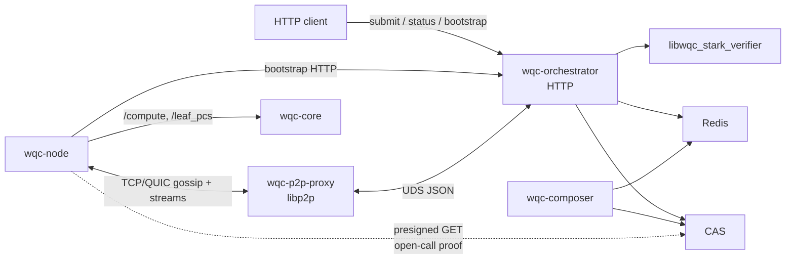
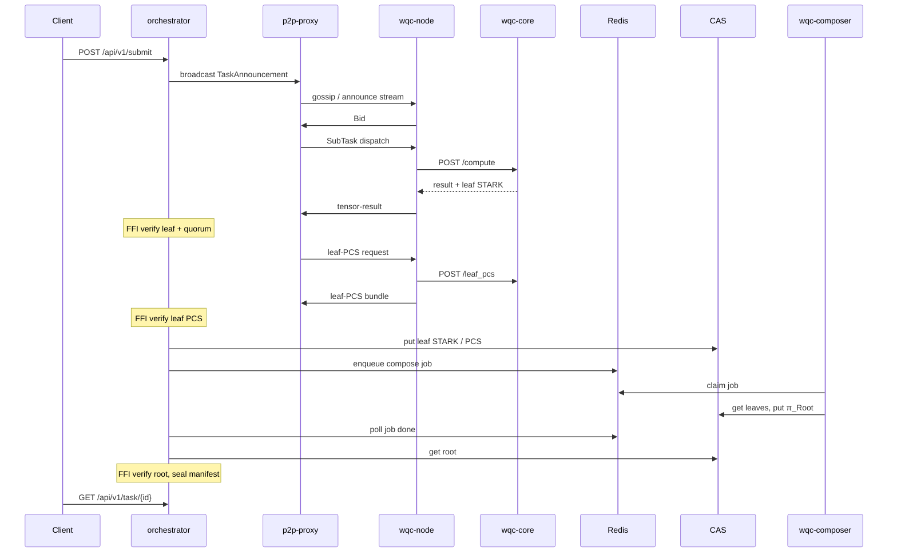

# WQC system architecture (current implementation)

- **Status:** Working spec — live component map
- **Tier:** B (implementation snapshot)
- **Verified:** 2026-08-19
- **Verified against:** `wqc-orchestrator@c94a447` `wqc-core@f162911` `wqc-node@9492fbd` `wqc-p2p-proxy@7898c96` `wqc-composer@ce3b3be` `wqc-stark-engine@db594b9`
- **Audience:** Implementers and operators who need the current component map
- **Related:** [`architecture.md`](architecture.md) — the target-state spec (sovereign network), [`zk-STARK.md`](zk-STARK.md), [`../examples/E2E.md`](../examples/E2E.md), [`../whitepaper/WHITEPAPER_0.3_en.md`](../whitepaper/WHITEPAPER_0.3_en.md)

> This document describes the **current** WQC stack as implemented: a single orchestrator,
> a permissionless worker swarm, and a remote composer that seals a root STARK.
> It is a snapshot of the system as it exists today and will be updated as the
> implementation moves toward the target architecture. For the finished-system
> specification, see [`architecture.md`](architecture.md).

Out of scope here: DHT multi-orchestrator, on-chain settlement, physical QPU backends, and marketing-site wiring.

---

## 1. Components

| Component | Kind | Role |
| --- | --- | --- |
| **wqc-orchestrator** | Daemon | HTTP client API, compact-register slicing, bid lottery, dispatch, quorum, leaf-PCS nomination, FFI verify, compose enqueue, manifest seal |
| **wqc-p2p-proxy** | Daemon (sidecar) | rust-libp2p endpoint. Gossip and streams on the public P2P port; control plane to the orchestrator over a Unix socket |
| **wqc-node** | Daemon | Swarm agent: bid, receive dispatch, return leaf proof / PCS. One in-flight sub-task per process. Admin HTTP only |
| **wqc-core** | Daemon | Per-node compute: tensor contraction, leaf STARK prove, `/leaf_pcs`. Also `POST /verify` (local/stateless). Local HTTP or Unix socket — not a library |
| **wqc-composer** | Daemon | Redis job worker: fetch leaf artifacts from CAS, build $\pi_{\text{Root}}$, write CAS + Redis. No P2P |
| **wqc-stark-engine** | Repository | STARK workspace. Crate `wqc-stark-core` is linked in-process by core and composer (prove / compose / local verify); crate `wqc-stark-ffi` exposes `libwqc_stark_verifier` linked into the orchestrator for **consensus verify** |
| **Redis** | Infra | Task meta, bids, economy ledger, compose job queue |
| **CAS** | Infra | S3-compatible content-addressed store for leaf STARKs, leaf PCS, root proofs, manifests |

The public testnet dashboard is an HTTP client of the orchestrator. Workers never call the client API. `wqc-core` is a process, not a crate workers link. Composer is a Redis consumer, not an HTTP compose API.

---

## 2. Network and trust

Clients submit over HTTP. Workers exchange signed libp2p messages with the proxy. Prove and compose stay in Rust processes. **Consensus** verification of worker proofs is orchestrator FFI (`libwqc_stark_verifier`). `wqc-core` also exposes `POST /verify` for local/stateless checks via `wqc-stark-core`; that path is not how the swarm ingests results.

| Boundary | What crosses | Trust |
| --- | --- | --- |
| Client ↔ orchestrator HTTP | Submit, task status, bootstrap, quote | Public edge. Billing keys off `client_id` + Redis escrow |
| Node ↔ orchestrator HTTP | `GET /api/v1/p2p/bootstrap` only | Pins orchestrator PeerID and pubkey before P2P |
| Node ↔ proxy libp2p | Announcements, bids, dispatch, results, PCS | rust-libp2p both sides. Inbound peer id must equal `node_id` |
| Proxy ↔ orchestrator UDS | Length-prefixed JSON control frames | Same host |
| Node ↔ core | `/compute`, `/leaf_pcs` (optional `POST /verify`) | Typically localhost |
| Orchestrator ↔ FFI | Leaf / leaf-PCS / root verify (consensus) | In-process, no network |
| Core / composer ↔ `wqc-stark-core` | Prove / compose / local verify | In-process, no network |
| Orchestrator / composer ↔ Redis and CAS | State, queue, blobs | Private. Open-call leaf proofs and completed manifests use presigned GET |

Results do not travel over HTTP. There is no node `/submit` and no result webhook.

Live P2P is the rust-libp2p sidecar. Do not treat an in-process Go libp2p host as the production path.

---

## 3. Task lifecycle

Client-visible status roughly: `pending` → `dispatched` → `finalizing` (`waiting_pcs` → `composing_proofs` → `sealing_manifest`) → `completed` | `failed`.

1. **Submit.** `POST /api/v1/submit` on the orchestrator. Optional escrow. Returns `task_id`. Poll `GET /api/v1/task/{id}`.
2. **Announce / bid.** Signed `TaskAnnouncement` over GossipSub (with a connected-peer stream fallback). Nodes bid; the orchestrator locks a quorum-sized worker set.
3. **Cut + dispatch.** Compact-register slices (`qubit_count = N-C` after fixing $C$ tensor legs, pruned circuit, `circuit_id` = SHA3-256 of that JSON). Signed `SubTask` to winners. One in-flight sub-task per node process.
4. **Compute + prove.** Node calls core `/compute`. Core contracts the slice and proves a v2 leaf STARK in-process, then the node returns result + proof on the result stream.
5. **Quorum.** Orchestrator FFI-verifies the leaf. Scalar / expectation use epsilon match; `sample_counts` must match exactly under the orchestrator-issued seed.
6. **Leaf PCS.** Winner is nominated to build a leaf PCS bundle. Majority refuse (memory gate) can failover, then an optional PCS open call (CAS upload + swarm bid). Exhaustion falls through to composer building missing PCS during compose. Completeness is required for the RecAgg v6 fast path; without it, compose falls through to the AggregationAir audit walk.
7. **Compose.** Finalizer uploads leaves to CAS and enqueues a Redis compose job. Composer builds a binary composition tree (a single leaf is duplicated) and writes $\pi_{\text{Root}}$. The orchestrator has no in-process compose path; without a composer on the same Redis and bucket, tasks stall in `composing_proofs`.
8. **Seal.** Orchestrator FFI-verifies the root, uploads root + result manifest to CAS, and the client receives `completed` with `root_hash` and a presigned `manifest_url`.

Transcript versions, public-input binding, and RecAgg are specified in [`zk-STARK.md`](zk-STARK.md). This page only names who produces and who verifies.

---

## 4. Deploy sketch

Keep this thinner than the logical maps; hostnames and compose files go stale.

| Plane | Typical members |
| --- | --- |
| Edge | TLS terminator + HTTP client (public testnet dashboard, or any API client) |
| Control | Orchestrator + p2p-proxy on one host (shared Unix socket). Redis and composer as siblings on the same Redis and CAS |
| Swarm | External `wqc-node` + `wqc-core` pairs (miners). Not co-located with the control plane in public testnet |

Dev and reference compose files may co-locate more of this on one machine. A stack without **wqc-composer** is not the live finalize path.

---

## 5. See also

- [`architecture.md`](architecture.md) — target-state specification (sovereign network)
- [`zk-STARK.md`](zk-STARK.md) — proof transcripts, AIR, leaf PCS, recursive aggregation
- [`../examples/E2E.md`](../examples/E2E.md) — submit/poll, status machine, manifest shape for a reference stack
- [`../whitepaper/WHITEPAPER_0.3_en.md`](../whitepaper/WHITEPAPER_0.3_en.md) — product and economics. The live phase is the centralized orchestrator + libp2p swarm; later DHT / on-chain sections are roadmap, not this diagram
