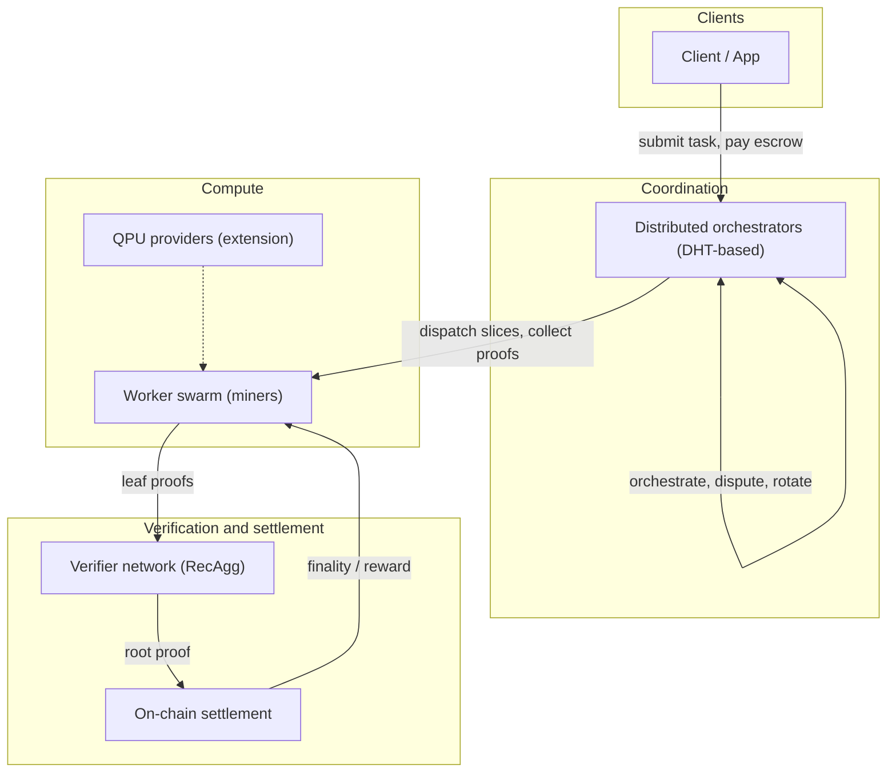
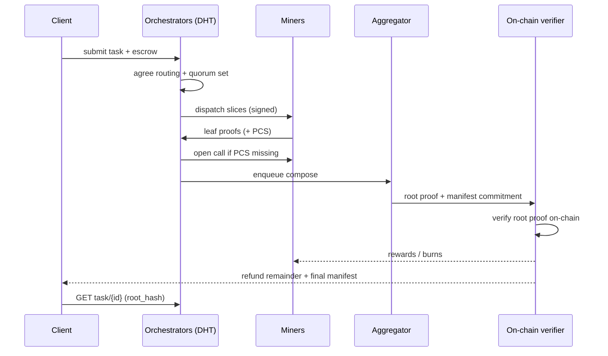

# WQC architecture specification (target state)

- **Status:** Draft
- **Tier:** A (canonical protocol spec)
- **Audience:** Protocol designers, researchers, and readers who need a specification of the finished system before it is fully built
- **Related:** [`architecture-current.md`](architecture-current.md) (current implementation), [`zk-STARK.md`](zk-STARK.md), [`../examples/E2E.md`](../examples/E2E.md), [`../whitepaper/WHITEPAPER_0.3_en.md`](../whitepaper/WHITEPAPER_0.3_en.md)

## Abstract

This document specifies the **target architecture** of the World Quantum Computer (WQC): a
permissionless, self-sovereign network in which anyone can offer quantum-simulation
computation, anyone can verify that the work was done correctly, and settlement happens
on-chain. It describes the *desired* end state — what the system must guarantee and how the
components must behave — not the current implementation. The current stack, which is a
single centralized orchestrator over a libp2p swarm, is a staged approximation of this
target and is documented separately in [`architecture-current.md`](architecture-current.md).

The full target in this specification is the **sovereign network** (whitepaper §5.4):
distributed orchestration, a permissionless worker swarm, recursive-verification-based
correctness, and on-chain verification and settlement. **Phase 3 mainnet** reaches on-chain
settlement while the coordinator is still centralized. DHT multi-orchestrator is
post-mainnet. Physical QPU backends and later hardware integration are outlined as
extensions, not specified here.

---

## 1. Purpose and scope

### 1.1 What this document specifies

The target architecture defines:

- **The set of actors** and their roles, rights, and obligations.
- **The trust model** and the guarantees the system provides under it.
- **The task lifecycle** from submission to on-chain settlement.
- **The proof and verification contract** that makes distributed work verifiable.
- **The economic and settlement contract** that makes the network sustainable.
- **The non-functional requirements** the network must meet.
- **The migration path** from the current centralized stage to this target.

### 1.2 What it does not specify

- The zk-STARK transcript, AIR constraints, and recursion internals — specified in [`zk-STARK.md`](zk-STARK.md).
- The current implementation layout — specified in [`architecture-current.md`](architecture-current.md).
- The narrative vision, tokenomics math, and marketing framing — the [`whitepaper`](../whitepaper/WHITEPAPER_0.3_en.md).

### 1.3 Relationship to the roadmap

The whitepaper defines four phases: (1) Foundation, (2) Scaling & Swarm Distribution,
(3) Mainnet Launch & On-chain Settlement, (4) Post-Mainnet Evolution. **Phase 2** (current)
is the centralized orchestrator over a libp2p swarm — see [`architecture-current.md`](architecture-current.md).
**Phase 3** moves escrow and root-proof verification on-chain but keeps a single coordinator.
**§5.4** (post-mainnet) replaces that coordinator with DHT-backed distributed orchestration.
This document specifies that **end state**. The migration in §10 matches those steps.

---

## 2. Target overview

The finished system (post-mainnet) is organized in four conceptual layers. Layers are
logical, not physical; a single process may host multiple roles. Phase 3 mainnet uses the
same proof and settlement contracts with a **single** orchestrator in the coordination
layer. DHT multi-orchestrator is §7 / whitepaper §5.4.

- **Clients** submit tasks and receive verifiable results and manifests. They never need to
  trust any single operator.
- **Coordination** is performed by a set of orchestrators that agree on task routing through
  a DHT-backed mechanism (see §7). No single orchestrator is a trust anchor.
- **Compute** is supplied by a permissionless swarm of miners. Each miner runs a node/core
  pair that contracts slices and produces leaf STARK proofs. QPU providers may attach as
  specialized compute in a later phase.
- **Verification and settlement** are the security base of the network: recursive proofs are
  aggregated into a single root proof that is verified on-chain, where rewards and
  penalties are applied atomically.

---

## 3. Actors and roles

| Actor | Role | Trust requirement |
| --- | --- | --- |
| **Client** | Submits tasks, escrows funds, polls status, receives final manifest | None. Results are self-verifiable via the root proof |
| **Orchestrator** | Routes tasks, issues slices, coordinates quorum, initiates disputes | Honest majority among orchestrators; a client must not need to trust any single one |
| **Miner (node + core)** | Bids on work, computes slices, produces leaf proofs, optionally builds leaf PCS | None. A dishonest miner can only lose its stake |
| **Aggregator (composer)** | Fetches leaf artifacts, builds the recursive composition tree, emits the root proof | None. Aggregation is checkable by any verifier |
| **On-chain verifier** | Verifies the root proof and executes settlement (rewards, burns, refunds) | The chain itself. Verification input is minimal: one proof, one commitment |
| **QPU provider** | Supplies physical-qubit execution for slices that require it (extension) | None; output still bound into the same proof pipeline |

Roles may overlap. In particular, a miner may also serve as an aggregator, and an
orchestrator may also be a client. What must never overlap is *unverifiable authority*:
there is no role that can unilaterally finalize a result without a proof.

---

## 4. Trust model and guarantees

### 4.1 Threat model

The target network is fully permissionless. It must remain correct and available when any
subset of the following adversaries exist:

- **Selfish miners** who submit fabricated or stale results to earn without working.
- **Colluding miners** who coordinate to return a wrong-but-agreeing answer.
- **Malicious or corrupt orchestrators** who attempt to censor, misroute, or stall tasks.
- **Free-riders** who consume escrow without producing verifiable work.
- **Sybil identities** that create many nodes to win bids by arithmetic rather than by stake.

### 4.2 Guarantees

- **Verifiable computation (soundness).** A task result is accepted only if its root proof
  verifies. False results cannot be finalized, regardless of how many miners agree on them.
- **Permissionless participation.** Any miner can join or leave without approval. Admission
  to *high-stakes* work is gated by stake, not by identity whitelists.
- **Censorship resistance.** No single orchestrator can prevent a task from being routed,
  executed, or verified. A stalled task can be taken over by other orchestrators.
- **Finality.** Settlement is a single on-chain transaction: the root proof either verifies
  and pays, or fails and refunds/penalizes. There is no off-chain "pending" that can be
  walked back.
- **Result integrity.** The manifest binds circuit, public inputs, slice set, and
  result hash. Any deviation is detected by any verifier with access to the proof.
- **Sybil resistance.** Influence over task routing and quorum selection is weighted by
  stake, so that a rational adversary prefers honest work over identity multiplication.

### 4.3 Non-guarantees (explicitly out of scope)

- **Privacy of submitted circuits.** Circuits are public by design; the system proves work
  over a public transcript. (ZK here proves *knowledge of the trace*, not circuit secrecy.)
- **Liveness under total network failure.** The system offers eventual progress; a
  partition that isolates all miners stalls tasks until the partition heals.

---

## 5. Task lifecycle (target)

The lifecycle is the same spine as today, extended with on-chain settlement and with
orchestrator rotation instead of a fixed coordinator.

1. **Submission.** A client submits a circuit, output mode, and parameters, and escrows
   the estimated fee. The task record is published under a `task_id` so that any
   orchestrator can serve status.
2. **Routing.** Orchestrators reach consensus on the slicing plan and the quorum-sized
   worker set. Routing is determined by stake-weighted selection (§7.3); no orchestrator
   unilaterally picks winners.
3. **Dispatch.** Each selected miner receives a signed `SubTask`: the pruned compact-register
   circuit, slice assignments, bond-dimension hints, and the shared result seed.
4. **Compute and prove.** Miners contract their slice and emit a leaf STARK proof bound to
   the task, slice, node identity, and result hash.
5. **Quorum and PCS.** Leaf results are checked against the quorum policy (epsilon match for
   scalars/expectations, exact match for `sample_counts` under the issued seed). Leaf
   proof-commitment (leaf PCS) bundles are produced by a designated miner, or by open call,
   or by the aggregator as a fallback.
6. **Aggregation.** An aggregator builds the recursive composition tree (a single leaf is
   duplicated into a binary tree when needed) and emits the root proof. The root proof
   commits to the entire task in one constant-size statement.
7. **On-chain settlement.** The root proof and a manifest commitment are submitted to the
   chain. On verification: miners are paid, the burn executes, the client receives its
   remainder and the final manifest. On failure: the escrow is refunded or redistributed
   according to the fault rules (§6.3).
8. **Verification by the client.** The client holds `root_hash` and the manifest. It can
   re-verify the root proof with any verifier, on-chain or off, without trusting the
   network.

---

## 6. Proof, verification, and settlement contracts

This section fixes the *contracts* between layers. The cryptographic detail lives in
[`zk-STARK.md`](zk-STARK.md).

### 6.1 Proof pipeline

- Every slice produces a **leaf proof** whose public inputs bind `circuit_id`,
  `sub_task_id`, `node_id`, `slice_id`, and `output_result_hash`.
- Leaf PCS bundles attach Circle polynomial-commitment openings so RecAgg can verify children
  in-circuit. A task must never depend on a **specific miner** producing the bundle
  (open call and aggregator fallback exist). Completeness is still required for the RecAgg
  v6 fast path; missing PCS falls through to an AggregationAir audit walk, which is sound
  but not $O(1)$.
- **Recursive aggregation** reduces any number of leaves to one **root proof** of constant
  size. The root proof is the single artifact that crosses into the settlement layer.

### 6.2 Verification contract

- **Off-chain verifiers** (orchestrators, aggregators, clients) verify leaf and root proofs
  locally with the FFI verifier; verification never requires re-executing the computation.
- **On-chain proof check** accepts only the root proof plus a small commitment
  (`root_hash`, `manifest_digest`, `task_id`). That check is stateless: it does not
  re-execute the circuit.
- **On-chain settlement** is separate: it reads escrow, stake, and reward accounts and
  applies §6.3 atomically after the proof check succeeds or fails.

### 6.3 Settlement rules

- **Success:** verified root proof → miners paid from escrow per work report, burn applied,
  remainder returned to the client.
- **Dispute:** a client or miner challenges a manifest via a root-proof re-verification.
  Because the proof is deterministic, a challenge has a binary outcome; there is no
  arbitration.
- **Timeout/stall:** if a task fails to produce a verifiable root proof within the
  grace period, the escrow is refunded to the client (minus penalties attributed to
  provably failing miners, if any).
- **Atomicity:** reward, burn, refund, and penalty settle in the same transaction.
  No partial settlement is possible.

---

## 7. Distributed orchestration (principles)

The DHT-based coordination layer is specified here at the level of principles and
guarantees. The concrete gossip/consensus details are left to a dedicated design document
that will be produced before mainnet.

### 7.1 Role of the DHT

- **Discovery:** miners and orchestrators find each other without a fixed registry.
- **Task routing:** task records and their routing state are replicated so that no single
  orchestrator is the point of failure.
- **Liveness:** an orchestrator that stalls or leaves can be replaced; in-flight tasks are
  re-announced and picked up by other orchestrators.

### 7.2 Orchestrator properties

- **No trust anchor.** A client's expectation of success must not depend on any specific
  orchestrator.
- **Agreement on state.** Orchestrators that serve the same `task_id` converge on the same
  task state; disagreement is resolved by the deterministic proof pipeline rather than by
  voting on *results* (orchestrators vote only on *meta* such as winner selection).
- **Rotation.** Orchestrator identity is not permanent; honest coordination is
  incentivized, and misbehavior is punishable on-chain.

### 7.3 Stake-weighted selection

- Influence over routing and quorum selection is proportional to staked funds, not to the
  number of identities.
- This makes Sybil multiplication pointless for a rational adversary and aligns
  coordinator incentives with network success.

---

## 8. Economic and settlement model

The economics of the network are specified in detail in the
[whitepaper](../whitepaper/WHITEPAPER_0.3_en.md); this section fixes only the architecture
constraints:

- **Escrow as the unit of commitment.** Every task carries an upfront escrow computed from
  the compact-register slice bound. The escrow is the maximum the client can lose and the
  miners' guarantee of payment.
- **Gas market.** The price of work reflects supply (miner capacity) and demand (queued
  tasks) on-chain; the mechanism must be transparent and not manipulable by the
  coordinator.
- **Burn.** The automatic burn rate is a fixed protocol constant applied at settlement.
- **Reward distribution.** Rewards are computed from attested work reports, which are
  themselves bound into the proof pipeline, so payment cannot be inflated by an operator.
- **Dispute economics.** Challenging a manifest costs a small bond that is forfeit if the
  challenge fails, preventing denial-of-service via arbitration spam.

---

## 9. Non-functional requirements

These are targets the network must meet at mainnet launch.

| Dimension | Requirement |
| --- | --- |
| **Scale** | Hundreds of concurrent tasks, thousands of miners, and slices that scale past current devnet bounds without a coordinator bottleneck |
| **Availability** | No single component (orchestrator, aggregator, DHT node) is a single point of failure for task finality |
| **Latency** | Task submission to on-chain settlement completes within the escrow grace period; proof aggregation must not be the asymptotic bottleneck |
| **Cost** | A client must be able to estimate and cap its total cost before submission |
| **Security** | Soundness of the proof pipeline holds at the declared security level (§4.2); economic safety (no mint/steal) holds under the settlement contract (§6.3) |
| **Verifiability** | Root-proof verification must be feasible off-chain on commodity hardware and on-chain within block-gas limits |

---

## 10. Migration path from the current stage

The current centralized stage and the target differ only in *coordination and settlement*;
the proof pipeline, slicing, and worker execution are shared. This makes the migration
incremental:

1. **Keep the proof spine.** The leaf/root proof pipeline and the manifest format do not
   change; everything built and verified today is valid input to the target system.
2. **Decouple settlement.** Move escrow and payments from Redis ledgers to the chain while
   keeping the single orchestrator for routing. This is the first on-chain integration.
3. **Decouple coordination.** Replace the fixed orchestrator with the DHT layer. Winner
   selection and quorum become stake-weighted; task state becomes replicated.
4. **Open the swarm.** Once coordination and settlement are decentralized, the remaining
   central conveniences (dashboards, reference orchestrators) are optional service
   providers, not the protocol.

At every step, a task that completes under the current stage must be acceptable under the
next. Compatibility of proofs and manifests is a hard migration requirement.

---

## 11. Future extensions

The following are explicitly deferred but reserved:

- **QPU backends.** Physical quantum processors attach as specialized compute. Their output
  is bound into the same proof pipeline; the network verifies that the *classical
  transcript* of execution is consistent with the QPU's claimed measurements.
- **Sub-second settlement.** Optimistic/aggregated on-chain verification if proof and block
  latency allow it.
- **Circuit privacy.** If a privacy-preserving execution model is later required, it is an
  additive layer on the public-transcript pipeline, not a replacement.

---

## 12. Glossary

| Term | Meaning |
| --- | --- |
| **D-PoUW** | Deterministic Proof of Useful Work — proving execution trace, not wasting energy |
| **RecAgg / recursive aggregation** | Reducing many leaf proofs into one constant-size root proof |
| **PCS** | Polynomial commitment scheme (Circle PCS). A **leaf PCS bundle** is the opening certificate used to compose a leaf in RecAgg |
| **Leaf / root proof** | Single-slice proof / task-wide aggregated proof |
| **Compact-register slice** | A pruned sub-task with `qubit_count = N − C` after fixing `C` tensor legs |
| **Manifest** | The signed artifact binding circuit, inputs, slices, and result hash |
| **Open call** | A public bid for a proof/PCS artifact placed in CAS when designated workers refuse |
