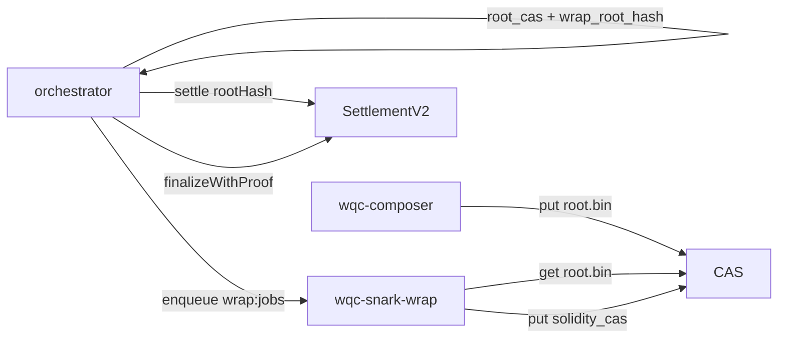

# SNARK Wrap of WQC Root STARKs for On-Chain Settlement

**A Formal Protocol Specification for the World Quantum Computer (WQC) Succinct Validity Layer**

- **Tier:** A (canonical protocol spec)
- **Related:** [`zk-STARK.md`](zk-STARK.md) (root STARK $\pi_{\text{Root}}$), [`architecture.md`](architecture.md), [`architecture-current.md`](architecture-current.md), [`economics.md`](economics.md), working ledger [`wqc-contracts` `docs/on-chain_settlement_scope.md`](https://github.com/world-qc/wqc-contracts/blob/main/docs/on-chain_settlement_scope.md) (public↔historical gate glossary)

---

## Abstract

WQC workers and aggregators produce a recursively aggregated STARK $\pi_{\text{Root}}$ whose
verification cost is feasible off-chain but not inside L2 block-gas limits at current
artifact sizes. This document specifies the **SNARK wrap** layer that reduces
$\pi_{\text{Root}}$ to a succinct argument $\pi_{\text{snark}}$ suitable for on-chain
settlement. The wrap is the artifact the L2 verifier checks on the **validity settlement
path**. An **optimistic settlement** path (commit + challenge window + off-chain
`verify_root_proof`) remains a Phase 3 rehearsal track and is not replaced by this
specification until the wrap gate reaches full root parity.

The normative cryptographic stack for the wrap is **gnark Groth16 over BN254**. The
document distinguishes **thin wrap** (settle-aligned public inputs and RecAgg header
bindings; host-only PCS payloads not verified in-circuit) from **thick wrap** (Plonky3
verifier gadgets in-circuit toward equivalence with off-chain `verify_root_proof`).

---

## 1. Introduction

### 1.1 Motivation

[`zk-STARK.md`](zk-STARK.md) defines leaf STARKs, leaf PCS, AggregationAir, and RecAgg so
that any verifier can check task integrity without re-execution. For on-chain settlement,
two constraints collide:

1. **Soundness** demands that paid work correspond to a verifying root argument.
2. **Gas** forbids verifying a multi-hundred-KiB (or multi-MiB) Plonky3 STARK inside the EVM
   at current profiles.

A SNARK wrap moves the expensive STARK check into an off-chain prover and leaves the L2
contract a constant-size pairing check plus a fixed public-input vector.

### 1.2 Relationship to optimistic settlement

| Path | On-chain artifact | Soundness mechanism |
| --- | --- | --- |
| **Optimistic settlement** | Commitments (`task_id`, `rootHash`, receipt / payout hashes) | Challenge window; dispute via off-chain `verify_root_proof` |
| **SNARK-wrap settlement** | Same economic finalize, plus $\pi_{\text{snark}}$ at finalize | Groth16 verify of wrap public inputs |

Phase 3 may ship optimistic settle for rehearsal while the wrap track matures. Mainnet
validity finality is defined by this document’s target (thick wrap ≡ `verify_root_proof`),
not by thin wrap alone.

### 1.3 Specification scope

This document specifies:

- Actors and trust boundaries for wrap prove / verify.
- The wrap **statement** and **public-input** encoding for SettlementV2 thin wrap.
- Thin vs thick semantic guarantees and explicit non-guarantees.
- Cryptographic assumptions (Groth16 / BN254) and trusted-setup boundaries.
- Off-chain job / CAS wire protocol between orchestrator and wrap worker.
- On-chain finalize interface (`finalizeWithProof`).

It does **not** re-specify STARK AIR, FRI, or RecAgg wire layouts — those remain in
[`zk-STARK.md`](zk-STARK.md). Gate tables, R1CS ladders, and KPI packs live in the contracts
settlement scope ledger.

### 1.4 Notation

| Symbol | Meaning |
| --- | --- |
| $\pi_{\text{Root}}$ | RecAgg root STARK blob (`root.bin`) |
| $\pi_{\text{snark}}$ | Groth16 proof of the wrap circuit |
| `rootHash` | $\mathrm{keccak256}(\pi_{\text{Root}})$ (Ethereum keccak, not NIST SHA3) |
| Thin wrap | Circuit `thin_wrap_v0` + SettlementV2 |
| Thick wrap | In-circuit Plonky3 gadgets toward ≡ `verify_root_proof` |

Historical engineering gate IDs (E5a / E5b / …) map to these public terms in the settlement
scope glossary; Tier A status narrative uses the public column only.

---

## 2. System model

### 2.1 Actors

* **Orchestrator:** After root seal, stores `root_cas` and `wrap_root_hash`. On validity
  settle, commits `rootHash` = wrap commitment, enqueues a wrap job, waits for wrap
  artifacts, and broadcasts `finalizeWithProof`.
* **Wrap prover (`wqc-snark-wrap`):** Claims Redis wrap jobs, fetches $\pi_{\text{Root}}$
  from CAS, proves $\pi_{\text{snark}}$, uploads proof / public / solidity calldata blobs.
* **L2 settlement contract:** Holds escrow and payout state; on finalize verifies
  $\pi_{\text{snark}}$ against public inputs rebuilt from storage + caller extras.
* **Client / miner:** Do not need to trust the wrap prover beyond cryptography and the
  published verification key; they already hold manifest / root commitments.

### 2.2 Trust model

- A dishonest wrap prover that cannot forge a Groth16 proof under the published VK cannot
  cause a false finalize.
- Thin wrap **does not** imply that every host-bound PCS opening inside $\pi_{\text{Root}}$
  was checked in-circuit; see §5.
- Trusted setup toxic waste for Groth16 is a deployment hazard: production keys require a
  ceremony; POC fixtures are rehearsal-only (§7).

### 2.3 Threats addressed

1. Finalizing settlement for a root commitment that does not match the CAS blob
   (`rootHash` binding).
2. Substituting RecAgg header digests (task / manifest / child stark digests / compose
   label) relative to the settled task.
3. (Thick track) Accepting a root that would fail off-chain `verify_root_proof`.

### 2.4 Threats not addressed by thin wrap

1. Full Plonky3 FRI / Mmcs / OOD soundness inside the circuit.
2. Bit-for-bit equivalence with the Rust FFI verifier for host-only PCS payloads.
3. Privacy of circuits or results (same public-transcript model as STARKs).

---

## 3. Architecture overview

1. Composer writes $\pi_{\text{Root}}$ to CAS; orch seals and records digests.
2. Relayer settles with `rootHash` = $\mathrm{keccak256}(\pi_{\text{Root}})$.
3. Orch enqueues wrap; worker proves and uploads Solidity-oriented calldata.
4. After the challenge window (SettlementV2 still retains a window before proof finalize),
   orch submits `finalizeWithProof(proof[8], extras)`.

---

## 4. Statement and public inputs (thin wrap / SettlementV2)

### 4.1 Circuit family

**Thin wrap** (`thin_wrap_v0`) is a Groth16 circuit whose public input vector has
**17** field elements. Digests are split into high/low **128-bit** big-endian limbs for
BN254 friendliness.

### 4.2 Public input layout

Let $\ell_{\mathrm{hi}}(h)$ / $\ell_{\mathrm{lo}}(h)$ be the high/low 128-bit limbs of a
32-byte digest $h$. SettlementV2 rebuilds:

| Index | Content |
| --- | --- |
| 0–1 | $\ell(\texttt{taskId})$ — $\mathrm{keccak256}(\texttt{parent\_task\_id})$ as stored / bound |
| 2–3 | $\ell(\texttt{rootHash})$ — $\mathrm{keccak256}(\pi_{\text{Root}})$ |
| 4–5 | $\ell(\texttt{receiptHash})$ — economics receipt commitment from settle |
| 6–7 | $\ell(\texttt{manifestRootHash})$ — RecAgg manifest bind |
| 8–9 | $\ell(\texttt{securityLevel})$ — $\mathrm{keccak256}(\texttt{UTF-8 security\_level})$ |
| 10–11 | $\ell(\texttt{leftChildDigest})$ — RecAgg left stark digest |
| 12–13 | $\ell(\texttt{rightChildDigest})$ — RecAgg right stark digest |
| 14–15 | $\ell(\texttt{COMPOSE\_LABEL\_ROOT})$ — fixed label bind for compose label `"root"` |
| 16 | $\texttt{pcs\_ok} = 1$ |

`WrapExtras` supplied at finalize carry manifest / security / child digests that are not
duplicated in settle storage. The contract rejects proof-less `finalize` on V2.

### 4.3 Root binding

The wrap prover **must** set `RootHash = keccak256(root.bin)` for the CAS object named by
the job’s `root_cas`. Orchestrator settle uses the same `wrap_root_hash` so that a
mismatched blob cannot verify under an honest VK.

### 4.4 RecAgg header extraction

Thin wrap parses the RecAgg V6 header from $\pi_{\text{Root}}$ sufficiently to bind
`compose_label = "root"`, manifest tag, and left/right stark digests, and sets `pcs_ok=1`
when the header path succeeds. Full recursive STARK verification is **out of scope** for
thin wrap (§5).

---

## 5. Thin wrap guarantees and non-guarantees

### 5.1 Guarantees (thin)

Under a correct Groth16 setup and VK:

1. The prover knew a witness consistent with the public input vector above.
2. `rootHash` matches keccak of the wrapped root bytes used in the witness.
3. RecAgg header fields bound into the PI are consistent with the witness extraction rules
   of `thin_wrap_v0`.

### 5.2 Non-guarantees (thin)

1. **Not** ≡ `verify_root_proof`: host-only Mmcs / FriFold / OOD (and nested group STARKs when
   present) are not fully re-checked in-circuit.
2. Thin wrap is a **settlement-aligned commitment wrap**, not a complete on-L2 STARK
   verifier.
3. POC trusted-setup keys are not production security assumptions (§7).

### 5.3 Operational status

Thin wrap toolchain, relayer path (`WQC_SETTLE_VALIDITY_PROOF`), and size/gas/latency KPI
locks may be Done/Partial in the engineering ledger while the **mainnet wrap gate** remains
blocked on thick root parity, audit, and target-L2 gas. Tier A treats thin as a defined
intermediate statement, not as mainnet completion.

---

## 6. Thick wrap track

### 6.1 Goal

**Thick wrap** adds Plonky3-in-circuit gadgets (ValMmcs, FriFold, OOD, RecAgg AIR /
FriFsAuth, leaf Auth, child-verify binds, unified profiles, …) so that accepting
$\pi_{\text{snark}}$ implies the same claim as off-chain `verify_root_proof` for the
declared security level and public inputs.

### 6.2 Residual

Working profiles, Auth×2 partials, Max→87KiB soft gates, ceremony / Settlement VK cutover,
and packed SettlementV3 prep are tracked in the contracts settlement scope §7 (engineering
IDs). This Tier A document requires only:

- A published circuit family and VK for the production profile.
- A stated equivalence claim relative to `verify_root_proof`.
- Gas and latency meeting the target L2 envelope.

Until equivalence is declared, mainnet must not treat thick rehearsal keys as the wrap
gate.

### 6.3 Packed finalize (cutover prep)

SettlementV3 / packed `proof[12]` adapters are a deployment cutover mechanism for thick N=1
profiles. They do not change the STARK semantics; they change calldata encoding. Default
production path remains thin / SettlementV2 until thick cutover is authorized.

---

## 7. Cryptographic stack and setup

| Item | Choice |
| --- | --- |
| Proof system | Groth16 |
| Curve | BN254 (alt-bn128) as supported by target L2 precompiles |
| Proving stack | gnark |
| L2 verifier | Solidity Groth16 verifier exported from wrap keys |

**Trusted setup.** Groth16 requires a circuit-specific SRS. Production deployment requires a
multi-party ceremony (or an accepted alternative with documented assumptions). Fixtures
under `fixtures/thin_v0/` (and thick N=1 rehearsal keys) are **POC / private rehearsal
only** and must not be cited as mainnet soundness.

STARK transparency (no STARK trusted setup) is preserved for $\pi_{\text{Root}}$; the wrap
layer reintroduces a setup assumption for succinct L2 verify.

---

## 8. Wire and job protocol

### 8.1 Redis

| Key | Role |
| --- | --- |
| `wrap:jobs` | Pending job ids (`LPUSH` / `BRPOPLPUSH`) |
| `wrap:processing` | Claimed job ids |
| `wrap:job:{id}` | JSON job document (TTL) |

Job fields include at least: job id, `root_cas`, settle-aligned digests needed to build
public inputs, and status fields updated by the worker.

### 8.2 CAS

Blobs use the same content-addressed layout as composer/orchestrator:
`blobs/sha256/aa/bb/<sha256-hex>`. The wrap worker reads `root_cas` and writes:

| Artifact | Role |
| --- | --- |
| `proof_cas` | Serialized Groth16 proof |
| `public_cas` | Public input encoding |
| `solidity_cas` | Calldata / JSON for `finalizeWithProof` (thin: `proof[8]` + extras) |

### 8.3 Orchestrator env (implementation binding)

| Variable | Meaning |
| --- | --- |
| `WQC_SETTLE_VALIDITY_PROOF` | `true` → wrap enqueue + `finalizeWithProof` |
| `WQC_SETTLE_PROOF_ABI` | `thin` (default) or `packed` (V3 prep) |
| `WQC_WRAP_TIMEOUT_SECS` | Max wait for wrap artifacts before finalize fails |
| `WQC_SETTLEMENT_CONTRACT` | SettlementV2 (thin) or V3 (packed) address |

These names are implementation bindings for the current orchestrator; the protocol
requirement is equivalent capability, not the env string itself.

---

## 9. On-chain finalize

### 9.1 SettlementV2

After `settle` stores `rootHash` / `receiptHash` / payouts and the challenge window closes:

1. Build the 17-limb public input vector (§4.2).
2. `verifier.verifyProof(proof, input)` for `uint256[8] proof`.
3. Emit validity-verified event and execute pay / burn / refund atomically.

Proof-less `finalize` reverts. Challenge resolution remains available as an operational
escape for the windowed period; validity soundness for the happy path is the wrap.

### 9.2 Interaction with economics

Normative fee / escrow / burn rules remain in [`economics.md`](economics.md). The wrap
layer only changes **how root validity is established** before economic finalize executes.

---

## 10. Security considerations

1. **VK pinning.** Settlement must hard-bind the verifier address (and thus VK) at deploy;
   rotating VK is a governance / redeploy event.
2. **Hash domain separation.** Ethereum keccak for settle binds; NIST SHA3 appears in other
   WQC manifests — implementations must not confuse the two when bridging orch meta.
3. **Job authenticity.** Wrap jobs are trusted to the Redis / orch control plane; a
   compromised orch can withhold finalize or starve the queue (liveness), but cannot forge
   proofs under an honest setup.
4. **Thin overclaim.** External communications must not describe thin wrap as full on-L2
   STARK verification.

---

## 11. Non-goals and future work

- In-EVM native STARK verify without wrap.
- Replacing RecAgg / leaf STARK design (owned by [`zk-STARK.md`](zk-STARK.md)).
- DHT multi-orchestrator (architecture post-mainnet).
- Completing thick ≡ `verify_root_proof` (engineering residual in settlement scope §7).

---

## 12. References

1. WQC [`zk-STARK.md`](zk-STARK.md) — leaf / RecAgg root proof engine.
2. WQC [`architecture.md`](architecture.md) §6 — verification and settlement contracts.
3. WQC contracts `on-chain_settlement_scope.md` — working ABI, gate tables, glossary.
4. Jens Groth. *On the Size of Pairing-based Non-interactive Arguments* (Groth16).
5. gnark / BN254 pairing precompiles on EVM-compatible L2s.
