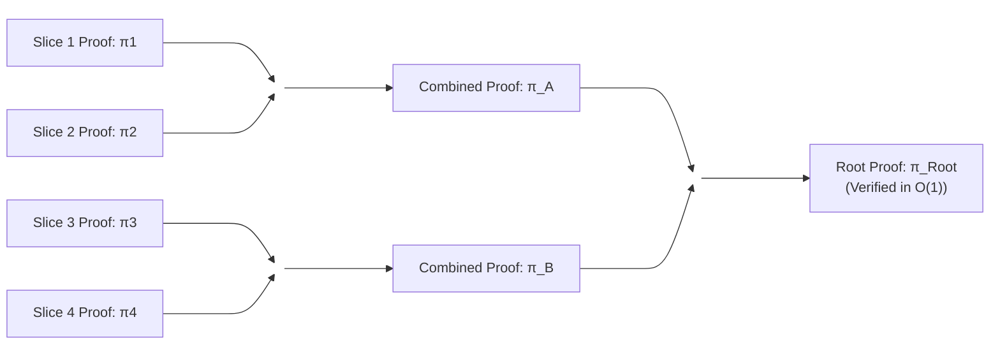
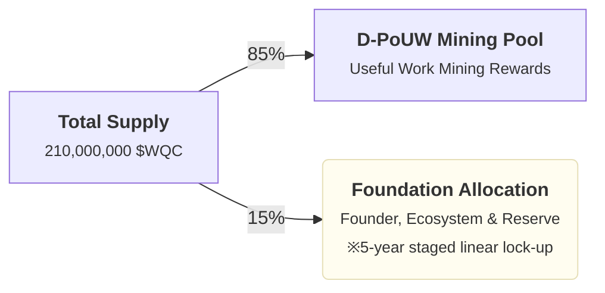
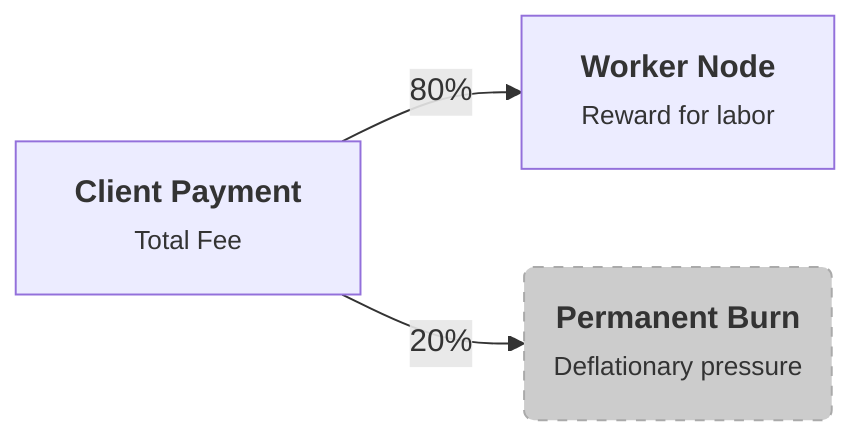

# World Quantum Computer (WQC) v0.2
### ~ A Decentralized Quantum Simulation Protocol to Shatter Centralized Hegemony ~

## 1. Preface: Rebellion Against Quantum Hegemony (Anti-Hegemony)

### 1.1 The Centralized Quantum Hegemony and Its Threat

Throughout the history of modern computing, the internet and cryptography have served as shields protecting individual sovereignty and privacy. Yet the "dawn of quantum computing" we face today carries an acute crisis of centralization—one that threatens to overturn the decentralized balance of power we have built over decades.

Today, developing and operating practical quantum computers (QPUs) requires capital investments on the order of hundreds of billions of yen, dilution refrigerators that maintain millikelvin temperatures, and highly specialized academic teams. These physical and economic constraints have produced an **oligopoly of quantum computing resources** dominated by a handful of nation-states, national-scale technology giants (Big Tech), and military-industrial complexes.

The future this monopoly portends is censorship of scientific freedom and the entrenchment of inequality. Access to the computational power that will decide "the next century of wealth and security"—new drug discovery, breakthrough molecular simulation of novel materials, financial market optimization, and the breaking of public-key cryptography (RSA, elliptic-curve cryptography, and the like) that underpins modern secure society—is now fully controlled by the private clouds of gatekeeping monopolists. They hold the power to vet **who** computes and **for what purpose**, and to block or censor any computation that conflicts with their interests or national strategy at any time.

World Quantum Computer (WQC) is an explicit rebellion against this privileged-class **quantum hegemony**—an open-source protocol that achieves the **democratization of computational resources** through cryptoeconomics.

### 1.2 Breaking Physical Limits: From One Giant Machine to a Planetary Nervous System

Centralized players are obsessed with manufacturing "a single giant machine" loaded with ever more physical qubits. Yet scaling superconducting circuits, ion traps, and similar hardware hits exponential physical limits—the memory wall and the hardware wall—in noise (decoherence) control and manufacturing cost.

The WQC protocol abandons the dogma of building one physically perfect computer. Instead, it takes the approach of **cryptographically connecting all existing computing devices on Earth**—commercial GPUs, SoCs with unified memory, surplus data-center capacity—and transforming them into **a single distributed nervous system**.

Throughout human history, only a tiny privileged class could own supercomputers or physical quantum machines. WQC makes the very concept of "owning a computer" obsolete. People around the world contribute hardware to the protocol and share one another's compute power; the participants of the network **become the computer itself**. That is WQC's ultimate vision.

> **"We are the Computer."**
>
> (We do not own the computer. We **are** the computer.)

## 2. "Physical and Structural" Challenges to Solve

Contemporary computing science and the ecosystem of distributed ledger technology (DLT) face three seemingly insurmountable barriers. WQC defines these not merely as technical hurdles but as **structural defeats** that block the expansion of human intelligence—and seeks to dismantle them.

### 2.1 Censorship of Abundance: Oligopoly of Access and the Privatization of Science

Physical quantum processing units (QPUs) operated by centralized firms such as IBM, Google, and Rigetti—or petascale simulation clouds owned by Big Tech with thousands of nodes—have become fully **closed gardens (censored spaces)**.

Access requires not only exorbitant fees (thousands of dollars for minutes of compute) but also passing corporate **purpose-of-use reviews**. This is serious censorship against the essence of scientific inquiry: **freedom and anonymity**.

Researchers affiliated with certain nations or regions, or DAOs (decentralized autonomous organizations) pursuing open-source alternative energy or drug development that conflicts with corporate interests, live under the constant risk of having access cut without notice. When the source of wealth and intelligence—computational resources—is controlled by corporate will, the result is structural **censorship of abundance** that slows scientific progress.

### 2.2 The Memory Wall: Exponential Explosion of the State Vector

The most classical yet destructive approach to simulating quantum computation on general-purpose hardware is **state vector simulation**. To track the full quantum superposition (all probability amplitudes) of $n$ qubits, this method must materialize $2^n$ complex numbers in memory.

Memory demand grows **exponentially** with qubit count.

| Qubits ($n$) | Required Memory | Hardware Limit |
| --- | --- | --- |
| **30 Qubits** | ~16 GiB | Typical consumer PC ceiling |
| **40 Qubits** | ~16 TiB | High-end data-center server clusters |
| **50 Qubits** | ~16 PiB | Entire memory of world-class petascale supercomputers (beyond practical limits) |

Building a single colossal supercomputer that can fully hold a state vector beyond 50 qubits is **physically impossible** under modern semiconductor physics and cost-effectiveness (ROI). This is **the Memory Wall**. Approaches that confine resources to one chassis or a closed cluster linked by a single high-speed internal bus (InfiniBand, etc.) have already hit theoretical limits.

### 2.3 The Futility of PoW: A Paradigm Shift from Thermodynamic Waste to Useful Work (PoUW)

Since Bitcoin's birth in 2008, Proof of Work (PoW) has proven the most robust method for eliminating centralized intermediaries and achieving trustless consensus. From a thermodynamic perspective, however, conventional PoW carries a fatal flaw.

Mining farms worldwide consume gigawatts executing **mathematically meaningless brute-force computation**: repeatedly changing a nonce until a hash function output (SHA-256, etc.) meets a difficulty target of leading zeros. The resulting hash is consumed only to finalize the next block—dumping enormous heat and carbon into the environment while contributing **not a single bit** to human knowledge or scientific progress.

What is needed now is a paradigm shift that converts this thermodynamic waste (digital electricity thrown away) into **useful work**—binding the security cost of maintaining the network directly to the executable cost of computations that advance humanity's frontier: quantum chemistry, cryptography, machine learning, and beyond (**Proof of Useful Work: PoUW**).

## 3. Technical Breakthrough: Hyper-Distributed Tensor Contraction

WQC overcomes the physical limits of holding quantum state vectors beyond 50 qubits by transforming quantum circuits into **tensor network (TN) representations** and applying **deterministic dynamic slicing**. This chapter defines the mathematical foundation by which tens of thousands of distributed Worker Nodes cooperatively compute a single massive quantum circuit in a **trustless** environment.

### 3.1 Tensor Network Slicing and Dynamic Optimization of Bond Dimension

Universal quantum circuit simulation beyond 100 qubits—the target of this protocol—is impossible even with all storage on Earth under conventional state vector methods. WQC makes it feasible through dynamic tensor network slicing.

Large quantum circuits are modeled not as state vectors loaded wholesale into memory, but as **collections of tensors**—gates as matrices, quantum states as indexed legs (dimensions). Simulating the full circuit reduces to **contraction**: collapsing tensor indices one by one.

The WQC Orchestrator (or future distributed aggregators) analyzes the topology of the submitted circuit graph and dynamically identifies cut lines (slice axes) where **bond dimension** is minimized.

By fixing a specific index $i$ (dimension $d$) and splitting the circuit, **slicing** decomposes one colossal task into $d$ mutually independent **slice tasks**.

$$T_{\text{global}} = \sum_{k=1}^{d} T_{\text{slice}}^{(k)}$$

The greatest advantage of this mathematical decomposition is that **Worker Nodes require no real-time communication (synchronization)**. Each slice computes in parallel independently, enabling planetary-scale asynchronous grid computing unaffected by network latency—the physical limits of the internet.

### 3.2 Deterministic Proof of Useful Work (D-PoUW)

WQC eliminates the power waste of nondeterministic hash brute force entirely. **The process of executing quantum simulation (tensor contraction) and cryptographically proving its validity** becomes the network's security anchor (PoUW).

Worker Node $n$ receives tasks not governed by luck but **deterministic** incentive rewards $R$ proportional to computational complexity and the cost of generating the zk-STARK proof $\pi$ that guarantees it. This reward model is strictly defined as:

$$R = \text{Gas}_{\text{quantum}}(C, \pi) \times \text{BaseFee}$$

Where:

* $R$: Total \$WQC token reward received by the Worker Node.
* $\text{Gas}_{\text{quantum}}(C, \pi)$: Endogenous **quantum gas** consumption integrating memory and compute cost of contracting circuit $C$, plus algebraic cost (NTT, etc.) of generating zk-STARK proof $\pi$.
* $\text{BaseFee}$: Gas unit price dynamically set by network-wide supply–demand (algorithmic control).

ASIC resistance in the WQC network—excluding oligopoly by giant specialized miners—is permanently enforced not by artificial memory-hard functions but by two **endogenous hardware barriers**:

1. **Tensor Contraction Bottleneck (Tensor Access Phase)**:
   Contracting indices of huge tensors exhibits **low arithmetic intensity**—the ratio of random memory buffer access to FLOPs is extremely high. No matter how densely compute units are integrated, the **memory wall** makes memory bandwidth the bottleneck.

2. **Proof Generation Bottleneck (STARK Proving Phase)**:
   Encoding contraction validity as AIR (Algebraic Intermediate Representation) constraints, then running NTT (Number Theoretic Transform) and FRI polynomial interpolation via Plonky3 and similar stacks. This demands ultra-wideband memory space for permuting millions of elements at speed.

Mining ASICs optimized only for generic ALU density are completely disadvantaged in ROI versus manufacturing cost for terabyte-scale random access and wideband memory (HBM, etc.). Commercial high-end GPUs (NVIDIA RTX series, etc.) and consumer SoCs with wideband unified memory (Apple M series, etc.) therefore achieve the highest execution efficiency by design—**forcing hardware democratization**.

### 3.3 Deterministic Verification via zk-STARKs and Recursive Proof (Recursive Aggregation Pipeline)

Having the Orchestrator or Layer-2 smart contracts re-execute and verify each result from tens of thousands of nodes would instantly collapse the system. WQC resolves exploding verification cost through **recursive proof composition**.

Each Worker Node performs contraction on its assigned slice and simultaneously generates cryptographic proof $\pi_{\text{slice}}$ of mathematical validity. Binding the following **public inputs** into the STARK circuit prevents task substitution, wrong slice branches, data tampering, and theft (front-running) of other nodes' results:

$$\text{Public Inputs} = \{ \text{circuit\_id},\ \text{sub\_task\_id},\ \text{node\_id},\ \text{slice\_id},\ \text{output\_result\_hash} \}$$

| Field | Meaning |
| --- | --- |
| `circuit_id` | Identifier (hash) of the post-slice circuit (pruned sub-circuit) |
| `sub_task_id` | Unique ID for the slice execution unit (derived from parent task ID and `slice_id`) |
| `node_id` | libp2p PeerID of the Worker Node that executed the computation |
| `slice_id` | Branch ID on the slice tree (e.g. `"0"`, `"01"`). Binds which slice assignment was executed |
| `output_result_hash` | Cryptographic hash of normalized JSON for the output tensor (in the current devnet, the contracted complex scalar amplitude) |

At ingest, the Orchestrator verifies that public inputs match dispatch content and P2P result payloads, then verifies the leaf STARK $\pi_{\text{slice}}$.

Rather than verifying every $\pi_{\text{slice}}$ directly, the Orchestrator (or aggregator) performs **recursive composition** in a tree (Proof Tree): generating **one new proof that verifies the fact that proofs $\pi_1$ and $\pi_2$ are both valid**.

Through this compression pipeline, the validity of thousands or tens of thousands of node computations converges to a single root proof ($\pi_{\text{Root}}$).

**Current devnet (Phase 2)** performs leaf-level STARK verification plus **R1+R2 aggregation** by the Finalizer over a binary Proof Tree and Aggregation STARK, storing `proof_root_hash` and `root.bin` as artifacts. Root verification fast path is a single aggregated STARK verify (effectively $\mathcal{O}(1)$ STARK). **In-circuit recursion (R3)**—full Plonky3 recursion verifying child proofs inside the STARK circuit for Layer-2 production—is intentionally deferred until L2 requirements are finalized.

Smart contract verifiers need verify only $\pi_{\text{Root}}$ regardless of original circuit size; verification cost is bounded at $\mathcal{O}(\log^2 M)$ in proof tree depth (after R3 completion, L2 achieves strict soundness trusting only the root). Exploiting mathematical asymmetry—heavy generation, instant verification—WQC gains unbounded scalability.

## 4. Tokenomics & Governance

WQC's economic design is grounded in cryptoeconomics where token value is determined purely by the cycle of **computational resource provision and consumption**, completely excluding governance oligopoly by capital. To prevent rounding error and precision loss on computers, all currency and fee calculations in the protocol use 18-decimal fixed-point arithmetic (arbitrary-precision integers) without floating point.

#### Currency Unit System

Currency and economic value in this protocol are strictly defined and managed by three units:

| Unit | Symbol | Fraction of 1 \$WQC | Origin and Use |
| --- | --- | --- | --- |
| **WQC** | \$WQC | $10^{0}$ (1) | Base currency unit. |
| **Shannon** | \$sWQC | $10^{-9}$ (one billionth) | **Base unit for quantum gas (Gas Price).** (Named for Claude Shannon, father of information theory) |
| **Planck** | \$pWQC | $10^{-18}$ (one quintillionth) | **Absolute smallest unit in the protocol.** All code (Go, Rust, L2 smart contracts) operates on **integers** in Planck units. (Named for the Planck constant, physics' minimum length) |

### 4.1 Supply Curve and Fair Launch Incentive Design

Total \$WQC supply is fixed at **210,000,000 \$WQC** (integer form: $210,000,000 \times 10^{18}$ Planck) with **no additional issuance under any circumstances**. The protocol adopts a **Pure Fair Launch** with no pre-sale or VC pre-allocation.

To secure initial contributors and sustained ecosystem development, total supply is strictly allocated and locked by smart contract at the following ratios:

#### 4.1.1 Foundation Allocation Liquidity Restrictions (Vesting Contract Specification)

15% of total supply (31,500,000 \$WQC) is allocated to the **WQC Foundation** for sustained development funding and founder team incentives. To prevent sudden inflationary pressure on markets and align founder and community interests long-term, the following **linear vesting** is enforced by L2 smart contract:

* **Cliff**: For 12 months from network launch (Genesis), not a single Planck of foundation allocation may be withdrawn (fully locked).
* **Linear Release**: After cliff, liquidity unlocks evenly in Planck units over the remaining 48 months (5 years total), second-by-second (timestamp-dependent).

#### 4.1.2 Founder Mining (The Early Adopter Advantage)

In the earliest period after Genesis when participation is lowest, it is fully legitimate on-protocol for the founding team to deploy compute resources (GPU/VRAM) and run D-PoUW—and it represents the greatest opportunity for **real yield**. Like Bitcoin, game-theoretic incentives ensure nodes that take early risk and support the network at peak efficiency earn the most \$WQC (Planck); founders can build wealth openly and fairly.

### 4.2 Quantum Gas Market Price Mechanism

When clients request quantum circuit simulation, fees consumed are computed as **quantum gas**. Required gas for one task is:

$$\text{Gas}_{\text{quantum}}(C, \pi) = \alpha \cdot \text{VRAM}_{\text{peak}}(C) + \beta \cdot \text{FLOPs}(C) + \gamma \cdot \text{ProvingTime}(\pi)$$

The transaction fee clients actually pay ($\text{Total Fee}$) multiplies this gas by dynamically varying gas unit price $\text{BaseFee}$ (unit: Shannon / Gas) according to network congestion (compute demand):

$$\text{Total Fee (in Planck)} = \text{Gas}_{\text{quantum}}(C, \pi) \times \text{BaseFee} \times 10^{9}$$

When the global pending task queue exceeds a threshold, $\text{BaseFee}$ rises automatically to encourage node entry (supply increase). When demand falls, $\text{BaseFee}$ converges to a floor, offering clients low-cost computation. All multiplication and addition in orchestrator internals and on-chain use arbitrary-precision integers (Go `big.Int`, Rust `U256`, etc.)—**not a single Planck of rounding error**.

### 4.3 20% Automatic Burn (Deflationary Burn) and Economic Sustainability

To provide permanent deflationary pressure (upward price pressure) on the WQC ecosystem, **20% of total fees ($\text{Total Fee}$) paid by clients is immediately sent to a burn address (`0x000...000`) by smart contract at settlement and permanently destroyed (burned)**.

Net reward $R_{\text{net}}$ received by Worker Node $n$ is enforced by integer arithmetic:

$$R_{\text{net}} = \lfloor \text{Total Fee} \times 80 \div 100 \rfloor$$

$$\text{Burn Amount} = \text{Total Fee} - R_{\text{net}}$$

(Here $\lfloor \dots \rfloor$ denotes integer division truncating remainder. Sub-Planck remainder from truncation is added to Burn Amount automatically.)

#### 4.3.1 Mathematical Consequences of Deflationary Economics

With this 20% automatic burn, the higher WQC usage (compute demand), the faster circulating \$WQC supply decreases.

$$\frac{d(\text{Supply})}{dt} = -0.20 \times \sum_{i} \text{Total Fee}_i$$

In this absolute deflation model, even if total supply shrinks and per-\$WQC market value soars extremely (e.g. one million times initial), the protocol supports payments subdivided to 18 decimal places (Planck units), so **settlement gridlock (liquidity crisis) cannot occur in principle**.

In a future of soaring value, setting $\text{BaseFee}$ as low as `0.000000001 Shannon` (= `1 Planck`) lets clients always request quantum computation at fair, tiny costs aligned with real fiat rates, while all token holders (founders, miners, long-term investors) enjoy sustained asset appreciation—a mathematically guaranteed **flywheel**.

## 5. Development Roadmap and Vision: Path to the Sovereign Network

WQC evolves from single-machine verification through a **semi-centralized devnet PoC** to a **fully autonomous quantum compute network (Sovereign Network)** censored by no nation or corporation. The three phases below reflect **implementation progress as of 2026**.

### 5.1 Phase 1: Foundation — **Complete**

Establishing single-node simulation engine and minimal end-to-end protocol pipeline proof.

* **Universal Gate Set**:
  `wqc-core` (Rust) supports major quantum gates (H, X, Y, Z, T, CNOT, CCNOT, etc.), enabling up to ~30-qubit state vector simulation on consumer hardware.
* **End-to-End Vertical Slice**:
  Connected Orchestrator, Worker Node, and Core; demonstrated pipeline from client submission through node compute to result aggregation (initial HTTP/Webhook path **replaced by libp2p P2P in Phase 2**).
* **Deterministic PoUW Prototype**:
  Abolished meaningless hash mining (legacy Argon2 memory-hard approach); confirmed "quantum circuit simulation + zk-STARK proof generation" operates in closed environment.

### 5.2 Phase 2: Scaling & Swarm Distribution — **Current (devnet PoC)**

Building the skeleton of a planetary Swarm on **libp2p**, connecting bidding, slice partitioning, verification, and off-chain economics.

#### Operational (e2e passing on devnet)

* **libp2p Swarm Communication**:
  Gossip `TaskAnnouncement`, bid stream (`/wqc/tensor-net/1.0.0`), dispatch (`/wqc/tensor-dispatch/1.0.0`), result return (`/wqc/tensor-result/1.0.0`).
* **Permissionless Bidding and Quorum**:
  Signed lottery bids, weighted selection, capability matching via `required_features`, slice-level majority vote (epsilon agreement).
* **Dynamic Slice Partitioning (Policy C)**:
  BFS slice tree from bid pool `max_qubit_capability`. No real-time synchronization between Workers required.
* **zk-STARK Verification and Public Input Binding**:
  Pre-ingest verification of §3.3 five fields (`circuit_id`, `sub_task_id`, `node_id`, `slice_id`, `output_result_hash`).
* **Proof Aggregation (R1+R2)**:
  Leaf STARK verify → binary Proof Tree → Aggregation STARK tail → `proof_root_hash` / `root.bin`.
* **Off-Chain D-PoUW Economy (E1–E4)**:
  `Gas_quantum × BaseFee` (sWQC / pWQC integers), 80/20 split, client escrow, dynamic BaseFee, S3 economics receipt.
* **Worker Resilience**:
  `wqc-node` SQLite pending task recovery, P2P result outbox (`pending_results`) with background retry, orchestrator bootstrap PeerID trust anchor, trapdoor audit and node BAN.

#### Partially Implemented / Ongoing (within Phase 2)

* **Full Tensor Network Migration**:
  Current approach uses **state vector method + slice tree** simplified partitioning. Full migration to TN engine with minimum bond-dimension cuts remains ongoing in `wqc-core` / Orchestrator.
* **Recursive Proof R3**:
  In-circuit recursion (true Plonky3 recursion) for L2 to trust root only is deferred. Devnet closes Phase 2 with R1+R2.
* **Operational Durability**:
  Node-side P2P result outbox / retry implemented. Observability enhancements (Prometheus, etc.) remain.

### 5.3 Phase 3: Sovereign Network & Hardware Integration — **Not Started**

Final stage eliminating centralized Orchestrator and achieving Web3 **serverless protocol sovereignty**.

* **P2P Discovery and DHT-Based Orchestrator Decentralization**:
  Abandon static bootstrap multiaddr dependency; multiple aggregators cooperate on task partition, assignment, and aggregation.
* **On-Chain Settlement (E5)**:
  L2 smart contracts verify $\pi_{\text{Root}}$, automatically execute \$WQC distribution to Workers and 20% burn in code. Deploy vesting contracts.
* **Physical QPU Proxy**:
  Define standard interface connecting independent physical QPUs as Workers alongside simulators.

## 6. Conclusion: We are the Computer.

The World Quantum Computer (WQC) protocol does not aim merely to replace existing supercomputers or quantum computers. It is a **cryptoeconomic paradigm shift** to destroy the monopoly structure of computational resources distorted by wealth and power—and return the freedom of scientific inquiry to everyone's hands.

We have long paid the price of **convenience** from technological progress with dependence on giant platform gatekeepers and the censorship that follows. That even "next-generation compute power" essential to new drug development, understanding the cosmos, and designing cryptography that secures society is being privatized by a small privileged class is the greatest bottleneck to the evolution of human intelligence.

WQC rebels against this centralized hegemony with the force of mathematics and economic rationality.

1. **Overcoming Physical Limits**:
   Abandon the dogma of building one colossal machine; unify Earth's dormant devices into one nervous system through tensor network slicing.
2. **End of Wasted Energy**:
   End the era of nondeterministic hash mining that erodes the planet; convert cryptographic zk-STARK proof generation itself into **Deterministic Proof of Useful Work (D-PoUW)**.
3. **Embodiment of Complete Fairness**:
   Enforce by code a Pure Fair Launch 2.0 with no pre-sale or VC allocation; distribute sovereignty and rewards only to pure contributors to the network.

WQC is neither a "product" owned by some corporation nor "infrastructure" managed by a particular state. It is humanity's first **open-source intelligence at planetary scale with no centralized master**.

We stop being entities that pay high fees to "own" computers from outside. People worldwide connect hardware to the protocol, share compute power, and run the network. Then **we ourselves become the world's largest computer**.

> **"We are the Computer."**
>
> (We do not own the computer. We **are** the computer.)
>
